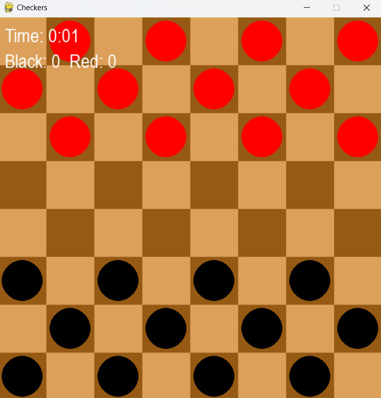
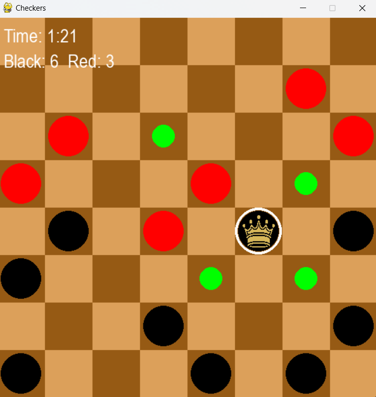
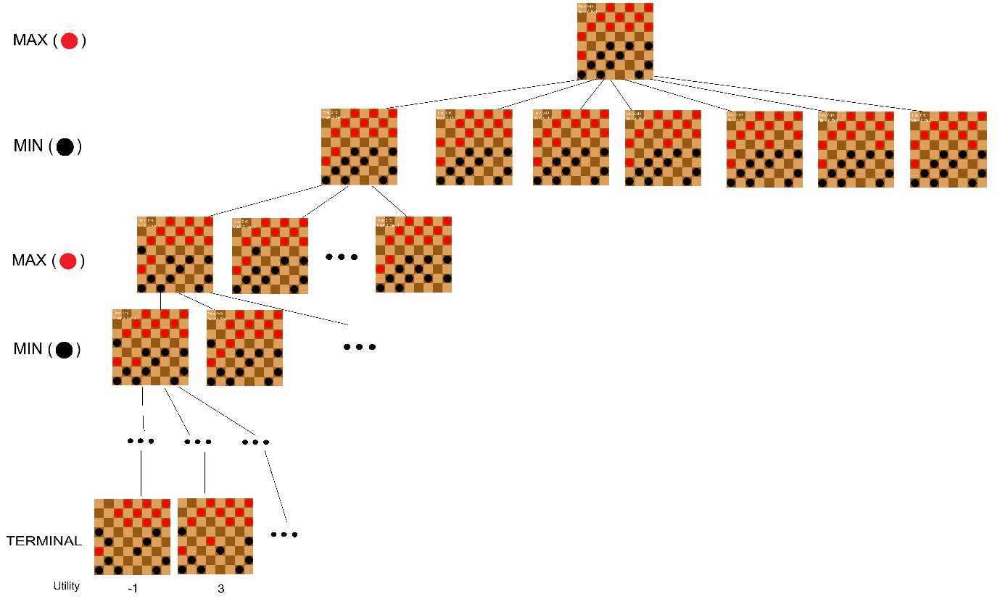
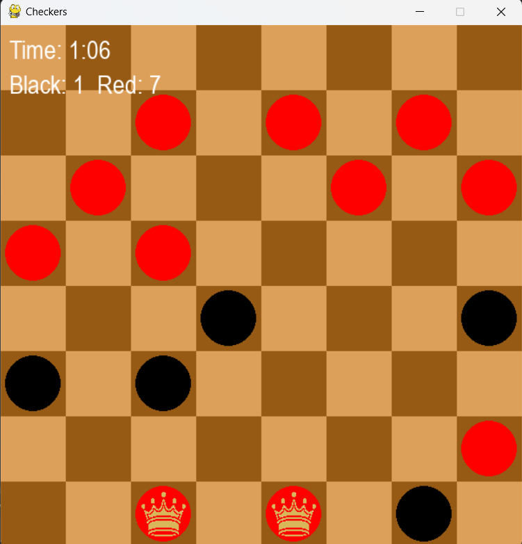
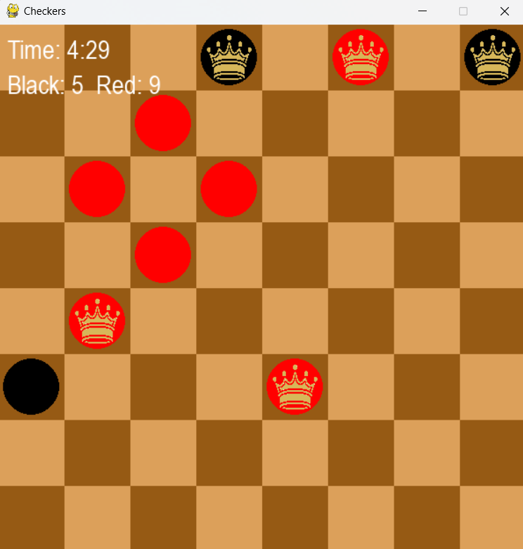
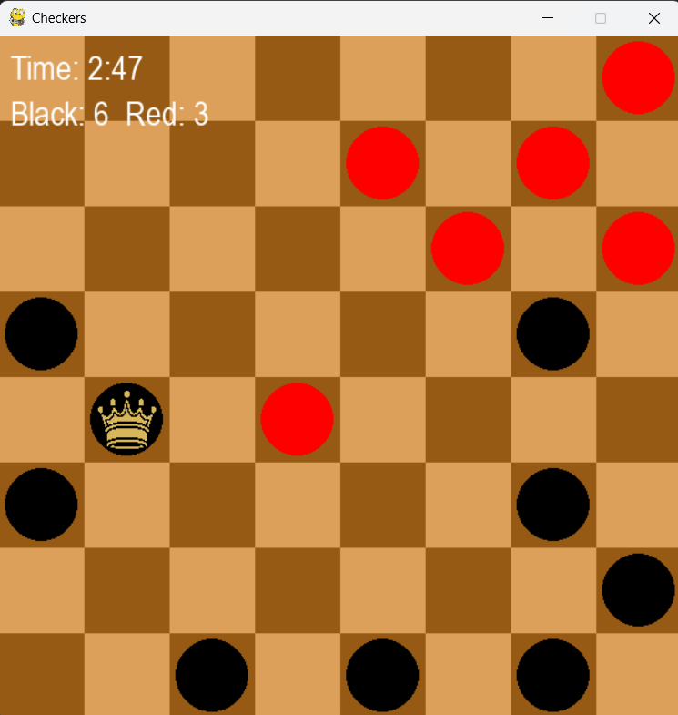

# Извештај за проектна задача по Вештачка интелигенција  
### Ана Папалазова 221006

## СПРОТИВСТАВЕНО ПРЕБАРУВАЊЕ – ДАМА (CHECKERS)

### Апстракт  
&nbsp;&nbsp;&nbsp;&nbsp;Овој извештај ја истражува примената на алгоритмите Minimax и Expectimax во играта Дама, фокусирајќи се на развој и анализа на различни евристички функции. Примарната цел е да се идентификува оптималната евристика за ефикасно донесување одлуки. 

## 1. Вовед  
&nbsp;&nbsp;&nbsp;&nbsp;Ова истражување е направено за потребите на мојата практична семинарска работа по предметот Вештачка интелигенција.     
Проблемот кој се обработува во овој проект е развивање на агент за играта Дама кој дава задоволителни резултати, кога ќе се соочи со човек. Истражувањето се однесува на примена на алгоритмите Minimax и Expectimax, со фокус на анализа на нивните евристики и оптимизација. Алгоритмите се дел од областа на вештачка интелигенција, конкретно од доменот на решавање игри со две спротивставени страни. Преку употреба на алфа-бета поткастрување и персонализирани евристички функции, истражувањето ги тестира и подобрува овие алгоритми за да обезбеди оптимални стратегии за играње.     

## 2. Опис на играта и нејзини правила  
&nbsp;&nbsp;&nbsp;&nbsp;Дама е вид стратешка игра на табла за двајца играчи која вклучува движење на фигури и земање на фигури од противникот со нивно прескокнување. Постојат повеќе различни верзии на играта во зависност од тоа во која држава се игра, некаде се игра на различна големина на таблата, а некаде има и различни правила. Јас избрав да ја имплементирам играта на шаховска табла 8x8 како што ја играле Американците, Русите, Турците и многу други.     
&nbsp;&nbsp;&nbsp;&nbsp;Бидејќи таблата е 8x8, составена е од 32 темни и 32 светли полиња. Се игра само на темните полиња, а таблата е поставена така што долу десно последното поле е светло. Пред почеток се поставуваат фигурите како на слика 1 и еден играч игра со црни фигури а другиот со црвени. Прв на потег е играчот кој игра со црните фигури, а потоа најизменично се менува играчот кој е на потег. Еден потег се состои од поместување фигура нанапред (дијагонално лево или десно) до соседниот празен квадрат. Ако соседниот квадрат содржи фигура на противникот, а квадратот веднаш по него е празен, фигурата може да се фати (да се отстрани од играта) со прескокнување преку неа. Откога ќе ја прескокне таа фигура, доколку веднаш може да прескокне и друга фигура од противникот, тоа ќе мора задолжително да го направи. Кога една фигура ќе застане на поле од последната редица таа фигура ќе стане крал и ќе може да се движи и нанапред и наназад. Ако еден од играчите нема ниту една останата фигура или ако сите фигури се попречени од противничките фигури и не можат да се придвижат, тој играч е губитник и со тоа завршува играта.    
     
     
**Слика 1. Почетен изглед на играта**    

&nbsp;&nbsp;&nbsp;&nbsp;За подобар дизајн, одлучив на екранот да се прикажува времето поминато во играта и резултатот кој покажува секој играч колку фигури му одзел на противникот. Исто така при селектирање на фигура се прикажува зелен круг врз полето на кое може да се придвижи таа фигура. Фигурата крал е означена со слика од круна. Сето ова може да се види на слика 2 каде што е селектирана фигурата крал.     
     
**Слика 2. Изглед на играта при селектирање фигура**    

## 3. Имплементација на алгоритми  
&nbsp;&nbsp;&nbsp;&nbsp;За подобро разбирање на алгоритмите кои ќе се користат, на слика 3 е прикажан дел од пребарувачкото дрво за одредена состојба на играта.         
     
**Слика 3. Пребарувачко дрво за играта**    

### 3.1 Minimax со алфа-бета поткастрување  
&nbsp;&nbsp;&nbsp;&nbsp;Minimax алгоритамот се обидува да го максимизира потегот на агентот и да го минимизира потегот на противникот. Алгоритамот ги разгледува сите можни потези на двете страни најизменично и го пребарува целото дрво до одредена длабочина. Притоа, на секое ниво се зема или максимална или минимална вредност во зависност од тоа кој играч е на потег. Дополнително искористив и алфа—бета поткастрување кое го намалува бројот на разгледувани гранки, дозволувајќи агентот да постигне исти резултати за пократко време.     

### 3.2 Expectimax  
&nbsp;&nbsp;&nbsp;&nbsp;Додека Minimax алгоритамот претпоставува дека противникот секогаш ќе го направи најлошиот можен потег за агентот, Expectimax алгоритамот се користи кога противникот прави случајни потези. Алгоритамот ги разгледува сите можни сценарија за исходот и пресметува очекувана вредност (веројатноста за секој можен потег на противникот).     
     
&nbsp;&nbsp;&nbsp;&nbsp;Во ова истражување алгоритамот Minimax е избран како главен поради неговата стабилност и способност да донесува оптимални одлуки за детерминистичка игра како Дама. Иако Expectimax алгоритамот може да биде корисен во средини со случајни фактори, природата на играта Дама го прави Minimax алгоритамот посоодветен.      
     
&nbsp;&nbsp;&nbsp;&nbsp;За да се поддржи оваа одлука, беше направен експеримент каде што алгоритмите Minimax и Expectimax се споредуваа директно еден со друг во различни комбинации. Резултатите од овие експерименти се детално анализирани во делот 6. Резултати.     

## 4. Одредување длабочина на пребарување     
&nbsp;&nbsp;&nbsp;&nbsp;За да одредам длабочина на пребарување тестирав со основна евристика која пресметува разлика помеѓу бројот на фигури на агентот и бројот на фигури на противникот. Во продолжение може да се погледнат резултатите од тестирањето:     
| Длабочина на пребарување| Просечно време на извршување| Победи на агентот| Забелешка |
|----------|----------------|--------|-----------|
| 3        | 0.5sec           | 3/5    | Брзо, но често прави грешки. |
| 5        | 1.5sec           | 4/5    | Добро избалансирана одлука. |
| 6        | 4sec             | 4/5    | Добро избалансирана одлука, но бавно. |     
---     
&nbsp;&nbsp;&nbsp;&nbsp;Според податоците добиени во табелата најдобра длабочина на пребарување е 5. Затоа, во понатамошното истражување ќе користиме длабочина на пребарување 5.     

## 5. Анализа на евристики  
### Евристика 1  
`Евалуација = Број на фигури на агентот – број на фигури на противникот`        

    
**Слика 4. Состојба на таблата во која ќе пресметаме евалуација за евристика 1**    

`Евалуација = Број на фигури на агентот – број на фигури на противникот = 11 – 5 = 6`     
&nbsp;&nbsp;&nbsp;&nbsp;Со оваа евристика, агентот многу се бранеше, а многу ретко напаѓаше (земаше фигури) дури и кога земањето на фигури беше подобар потег, особено во состојби кога имаше помал број на фигури од противникот.     

### Евристика 2  
`Поени од сите фигури=(Број на фигури на агентот – број на фигури на противникот) * 1`     
`Поени од кралеви = (Број на кралеви на агентот – број на кралеви на противникот) * 2`     
`Евалуација = Поени од сите фигури + Поени од кралеви`     
&nbsp;&nbsp;&nbsp;&nbsp;Кралевите играат многу голема улога во целата игра, а во претходната евристика воопшто не се вклучени. Со поголем број на кралеви, најчесто е полесно да се дојде до победа, па поради тоа доделив различни вредности на фигурите, односно секоја фигура има вредност 1, додека пак крал има вредност 2, со тоа што кралот се брои и во обични фигури и во кралеви. Со тоа агентот ќе се обидува да има што повеќе кралеви во игра, а и да спречи зголемување на бројот на кралеви на противникот.     
     
**Слика 5. Состојба на таблата во која ќе пресметаме евалуација за евристика 2**    

`Поени од сите фигури = (Број на фигури на агентот – број на фигури на противникот) * 1 = (7 - 3) * 1 = 4`      
`Поени од кралеви = (Број на кралеви на агентот – број на кралеви на противникот) * 2 = (3 - 2) * 2 = 2`      
`Евалуација = Поени од сите фигури + Поени од кралеви = 4 + 2 = 6`          
&nbsp;&nbsp;&nbsp;&nbsp;Оваа евристика се покажа како најдобрата проценка досега, бидејќи успешно ги комбинира бројот на обични и кралски фигури со нивната релативна важност. Во досегашното тестирање, таа значително го подобри квалитетот на играта на агентот.     

### Евристика 3  
`Евалуација = Број на фигури на агентот во центарот – Број на фигури на противникот во центарот`     
&nbsp;&nbsp;&nbsp;&nbsp;Тестирав и поинаква евристика, која брои само колку фигури се во центарот на таблата. Всушност, оваа евристика поттикнува позиционирање на фигурите кон центарот бидејќи таму имаат повеќе можности за движење, а не доделува вредност на оние што се на работ од таблата.    
     
**Слика 6. Состојба на таблата во која ќе пресметаме евалуација за евристика 3**    

      
`Евалуација = Број на фигури на агентот во центарот – Број на фигури на противникот во центарот = 1 – 0 = 1`      
&nbsp;&nbsp;&nbsp;&nbsp;По тестирањата на евристиката, заклучив дека ова е лоша евристика бидејќи агентот се фокусира фигурите постојано да му се во центарот на таблата, со што прави многу грешни потези.      

## 6. Резултати  
&nbsp;&nbsp;&nbsp;&nbsp;За да се анализираат перформансите на Minimax и Expectimax алгоритмите, направив експеримент во кој играа агентите меѓусебно во различни комбинации. Целиот експеримент е извршен со длабочина на пребарување 5.          
| Играч 1 | Играч 2 | Поени на играч 1 | Поени на играч 2 | Просечно време на извршување на играч 1 | Просечно време на извршување на играч 2 |
|---------|---------|---------|---------|---------|---------|
| Minimax | Minimax | 12      | 6       | 1sec      | 1sec      |
| Expectimax | Expectimax | 9 | 12 | 13sec | 13sec |
| Minimax | Expectimax | 12 | 7 | 3sec | 14sec |
| Expectimax | Minimax | 9 | 12 | 14sec | 3sec |
---
&nbsp;&nbsp;&nbsp;&nbsp;Од извршениот експеримент, може да се заклучи дека Minimax алгоритмот е подобар избор за играта Дама, особено во контексти каде што стабилноста и брзината на одлуките се критични.          
&nbsp;&nbsp;&nbsp;&nbsp;Дополнително, за избор на евристика направив тестирање во кое со секоја евристика играв пет пати против агентот, кој беше имплементиран со Minimax алгоритам со алфа-бета поткастрување и со длабочина на пребарување 5. Во продолжение може да се погледат резултатите од тестирањето кое го извршив.        

| Евристика | Победи на агентот | Порази на агентот | Просечно време на извршување |
|---------|---------|---------|---------|
| 1 | 4 | 1 | 2sec |
| 2 | 5 | 0 | 3sec |
| 3 | 1 | 4 | 2sec |
---
 Од табелата се гледа дека најдобра евристика е втората.

## 7. Заклучок  
&nbsp;&nbsp;&nbsp;&nbsp;Од претходната анализа заклучивме дека за играта Дама подобар алгоритам е Minimax со алфа-бета поткастрување, отколку Expectimax. Според истражувањето воочивме дека агентот е најдобар кога користи длабочина на пребарување 5. Дополнително, заклучивме дека најдобра евристика е втората евристика која доделува вредности на различните видови фигури и тоа вредност 1 на секоја фигура и вредност 2 на фигура која е крал.      

## 8. Референци  
[1] Stuart Russell и Peter Norvig. Artificial Intelligence: A Modern Approach, 3rd Edition. Prentice Hall, 2010. https://github.com/yanshengjia/ml-road/blob/master/resources/Artificial%20Intelligence%20-%20A%20Modern%20Approach%20(3rd%20Edition).pdf

[2] Judea Pearl. Heuristics: Intelligent Search Strategies for Computer Problem Solving. Addison-Wesley, 1984. https://mat.uab.cat/~alseda/MasterOpt/Judea_Pearl-Heuristics_Intelligent_Search_Strategies_for_Computer_Problem_Solving.pdf

[3] Yoav Shoham и Kevin Leyton-Brown. Multiagent Systems: Algorithmic, Game-Theoretic, and Logical Foundations. Cambridge University Press, 2009. https://www.masfoundations.org/mas.pdf
